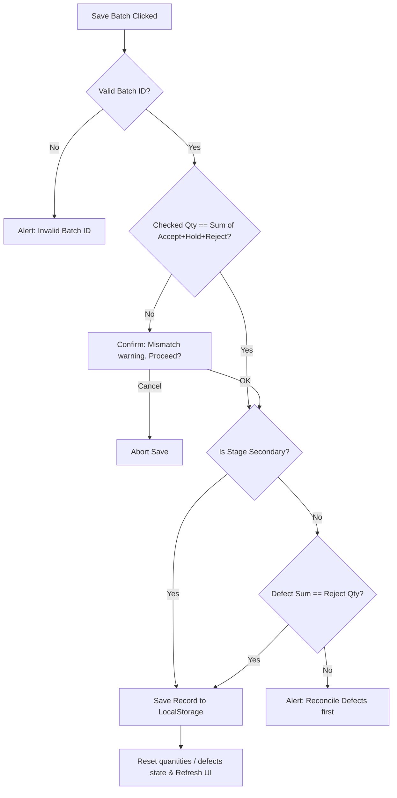

# Disposafe Manufacturing Data Entry System - Documentation

This documentation provides a comprehensive operational and technical reference for the customized single-form interactive data entry system built for the **Disposafe Catheter Manufacturing Floor**.

---

## 🖥️ System Overview
The application is hosted locally as a premium, self-contained single-page workstation dashboard:
* **Target File**: [Disposafe_Data_Entry_Matrix.html](file:///C:/Users/Lakshunbalaji/Downloads/Disposafe_Data_Entry_Matrix.html)
* **Design Aesthetic**: Modern industrial dark mode layout using curated, harmonious tones (`#13161f` page background, slate inputs, interactive neon accent states) optimized for physical shopfloor tablet screens.

---

## 🛠️ Key Functionalities & Workflows

### 1. Multi-Tier Macro & Process Navigation
The production lifecycle is mapped hierarchically to structure input entries:
* **Macro Stages (Tier 1)**: Clickable buttons to choose the department sector:
  * **Primary Production (P1-P9)** (Dipping Department)
  * **Secondary Production (P10-P14)** (Washing & Siliconization)
  * **Assembly (P15-P27)** (Post-curing workstation line)
* **Process Branches (Tier 2)**: 
  * **Interactive Selection (Assembly Only)**: Allows operators to toggle active sub-stations: *Visual (P17)*, *Balloon Inspection*, *Valve Fixing*, and *Final Inspection*. Toggling updates the active defect schema and resets the form values to prevent data cross-contamination.
  * **Showcase Badges (Primary & Secondary)**: Displayed as static reference badges showing process steps (e.g. Tunnel Washing P10, Assembly Prep P12). Data entry is done at the Department level.

---

### 2. Bi-directional Batch ID Binding
The system eliminates Batch ID typing errors with an automated parser:
* **Form-to-ID**: Selecting a Date and Catheter Size dynamically builds the Batch ID in the nomenclature:
  `YY + Month Code (A to L) + DD + "-" + Size (FR)`
  * *Example*: Selecting `June 27, 2026` and `14Fr` yields `26F27-14`.
* **ID-to-Form**: Typing a valid Batch ID manually (e.g. `26H23-16`) parses the string instantly to map and update the Date picker to `2026-08-23` and select the `16Fr` size dropdown option.
* **Breakdown Badges**: The parsed details are visually displayed below the field as distinct colored tags (Year, Month Name, Day, Size in Fr) for immediate confirmation.

---

### 3. Rejection Defect Entry Grid
Located permanently above the **Remarks/Notes** block to track department-specific yield dropouts.

#### Department & Station Schemas
* **Primary Production**: Displays 8 dipping defects:
  `COAG`, `Raised Wire`, `Surface Defect`, `Overlaping Layer`, `Black Mark`, `Latex Webbing`, `Missing Formers`, `Others`.
* **Secondary Production**: **Defect card is hidden**. Rejections are logged directly as a quantity value without breakdown, bypassing defect validation.
* **Assembly (Visual & Final Inspection)**: Both **Visual (P17)** and **Final Inspection** stations share the same 21 detailed visual inspection defects:
  `COAG, SD, TT, BL, PS, SB, PW, FP, RW, BEP, DEC, BM, WEB, BT, SF, BIC, WK, BMP, TF, PH, BST`.
* **Assembly (Balloon Inspection)**: Shows 4 balloon integrity defects:
  `STRUCK BALLOON`, `BALLOOM BRUST`, `LEAKAGE`, `OTHERS`.
* **Assembly (Valve Fixing)**: Shows 5 valve defects:
  `LEAKAGE`, `90/10 Ratio Fail`, `BUBBLE`, `THIN SPOD`, `OTHERS`.

#### Typing & Interactivity Features
* **Typeable-Only Input fields**: Replaced all increment buttons. Fields are standard numeric text inputs with a blank placeholder `0`, allowing operators to tab-index and type speeds rapidly on physical numerical pads.
* **Visual Active Highlights**: Typing a count `> 0` applies a bright neon-blue outline/highlight to both the input box and its corresponding container card, giving clear visual feedback on which rejections have entries.
* **Label Optimization**: If the defect key code matches its full name (e.g., `Assembly Issue`), the system hides redundant secondary text lines.
* **Auto-Incrementing Reject Qty**: If an operator inputs a defect value that causes the total defect sum to exceed the main **Reject Qty** field, the system automatically increases the main **Reject Qty** input to match, maintaining validation parity.

---

### 4. Local Persistence & Shift Export
* **LocalStorage Database**: Batch entries are saved locally under the table **"Saved Batches (This Shift)"**. Refreshing or closing the tab does not erase logged shift data.
* **CSV Shift Export**: Export button generates a CSV formatted to align with the monthly cumulative files (`09 REJECTION ANALYSIS-DECEMBER 2025 (2).xlsx` columns) for direct copy-pasting.

---

## ⚙️ Technical Schema & State Management

The core state is managed in a single, mutable global object in JavaScript:

```javascript
let state = {
    macro: 'assembly',        // Active macro stage ('primary', 'secondary', 'assembly')
    micro: 'p15-visual',      // Active micro branch (e.g. 'p15-visual', 'p16-balloon')
    date: 'YYYY-MM-DD',       // Date picked or parsed
    size: '14Fr',             // Dropdown selected size
    operator: 'OperatorName', // Active logging operator
    checked: 0,               // Checked Qty input
    accept: 0,                // Accept Qty input
    hold: 0,                  // Hold Qty input
    reject: 0,                // Reject Qty input
    defects: {},              // key-value object of active logged defects (e.g. { COAG: 2, SD: 1 })
    remarks: '',              // Remarks text
    savedBatches: []          // History array loaded from localStorage
};
```

### Flow Diagram of Save Validation

