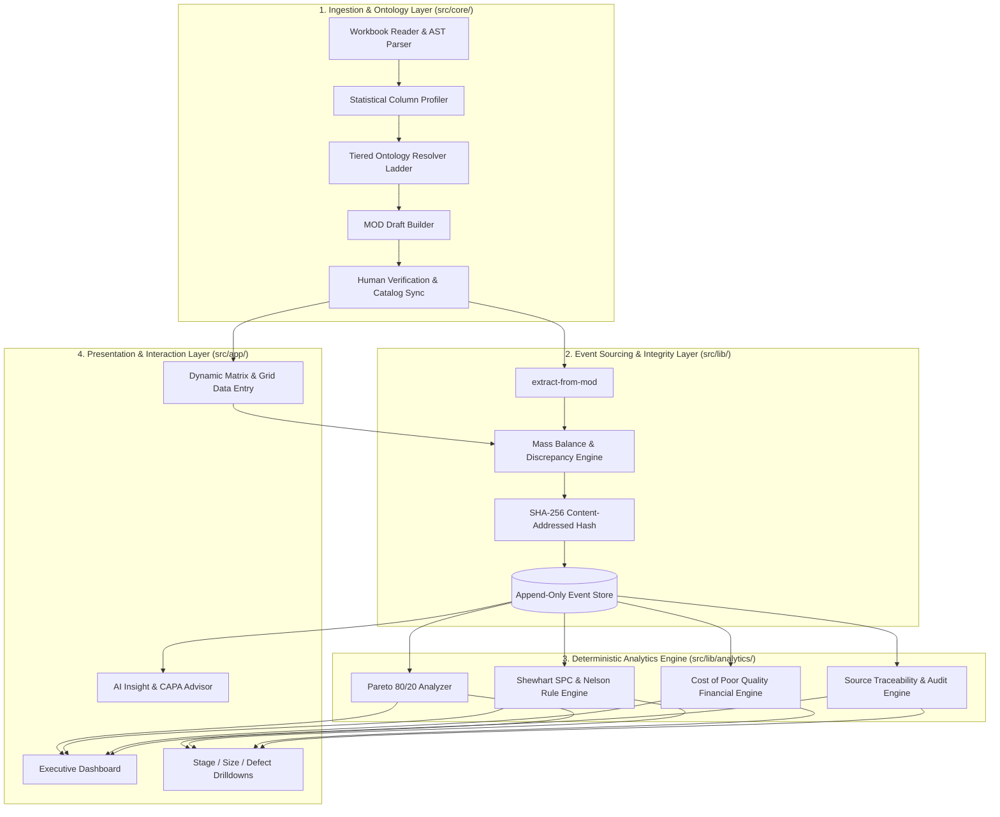
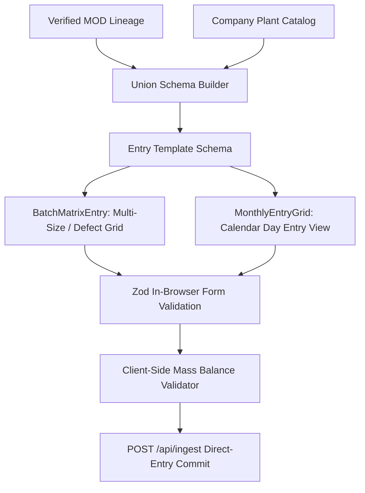

# MOID (RAIS-Pro) — System Architecture, Logic & Algorithm Specification

This document provides an exhaustive, engineering-grade breakdown of the software architecture, data structures, algorithmic pipelines, mathematical calculations, and invariant logic powering **MOID (RAIS-Pro)**.

---

## 1. High-Level Architecture Overview

MOID is structured into four distinct architectural layers with strict separation of concerns:



---

## 2. Ingestion & Ontology Subsystem (`src/core/`)

### 2.1 Lossless Workbook Ingestion & Header Detection
Files uploaded to `/api/workbooks` are processed without data loss:
- **Parser (`src/core/workbook/reader.ts`):** Converts raw Excel workbooks into normalized 2D sheet arrays while retaining original cell coordinates (`A1:Z100`), formulas, raw values, and formatted values.
- **Header Boundary Detection Algorithm (`src/core/workbook/header-detection.ts`):**
  Excel sheets frequently contain title blocks, merged banner cells, or blank rows.
  The algorithm iterates down candidate rows calculating a **Header Likelihood Score**:
  $$S(r) = w_1 \cdot \text{StringRatio}(r) + w_2 \cdot \text{Distinctness}(r) + w_3 \cdot \text{NonEmptyRatio}(r) - w_4 \cdot \text{NumericRatio}(r)$$
  The row maximizing $S(r)$ above threshold $\theta = 0.75$ is marked as the primary header row $r_h$. All rows $r > r_h$ are indexed as potential data records.

---

### 2.2 The Column Profiler (`src/core/profiler/index.ts`)
Each column $c_j$ from sheet $S$ is analyzed to produce a statistical profile $\mathcal{P}(c_j)$:
$$\mathcal{P}(c_j) = \langle \text{dtype}, \text{cardinality}, \mu, \sigma^2, \text{nullRatio}, \text{patternSamples}, \text{distinctValues} \rangle$$
- **Type Discrimination:** Differentiates `DATE`, `INTEGER`, `DECIMAL`, `STRING_CODE`, and `FREE_TEXT`.
- **Distribution Metrics:** Computes min, max, median, and variance across non-empty cells to differentiate record counts from identification numbers.

---

### 2.3 The 5-Tier Ontology Resolver Ladder Algorithm (`src/core/ontology/resolver/`)

The resolver maps raw source column headers to canonical roles:
- `production_date`: Timestamp / day of inspection.
- `batch_id` / `lot_no`: Production identifier.
- `quantity_checked`: Total units inspected.
- `quantity_rejected`: Total rejected units.
- `defect:<defect_id>`: Specific defect count (e.g. `blunt_tip`, `bent_needle`, `flash`).
- `size:<size_id>`: Specific product dimension (e.g. `18G`, `20G`, `22G`).
- `stage:<stage_id>`: Production stage (e.g. `cannula_cutting`, `assembly`, `packaging`).

#### Algorithmic Resolution Stages:

```
Algorithm 1: ResolveColumnRole(rawHeader, columnProfile, plantCatalog)
-------------------------------------------------------------------------
Input: Raw string `rawHeader`, Column Profile `P`, Plant Catalog `C`
Output: Candidate Role `R`, Confidence `c` ∈ [0, 1]

1. normalized = Normalize(rawHeader)   // lowercase, trim, remove symbols

2. // Tier 1: Exact Master Ontology Match
   if normalized ∈ GlobalOntologyKeys then
       return (GlobalOntology[normalized], 1.00)

3. // Tier 2: Learned Plant Catalog & Aliases
   if aliasMatch = C.findAlias(normalized) then
       return (aliasMatch.canonicalRole, 0.95)

4. // Tier 3: Deterministic Regex & Domain Heuristics
   if matchesRegex(normalized, /^(date|dt|mfg\s*date|prod\s*date)$/i) then
       return ("production_date", 0.90)
   if matchesRegex(normalized, /^(lot|batch|lot\s*no|b\s*no)$/i) then
       return ("batch_id", 0.90)
   if matchesRegex(normalized, /^(total\s*insp|qty\s*chk|checked|total\s*prod)$/i) then
       return ("quantity_checked", 0.88)
   if matchesRegex(normalized, /^(total\s*rej|rejected|total\s*def)$/i) then
       return ("quantity_rejected", 0.88)

5. // Tier 4: String Similarity & Levenshtein / Jaro-Winkler Distance
   bestFuzzy = argmax_{d ∈ C.Defects} JaroWinkler(normalized, d.alias)
   if bestFuzzy.score >= 0.82 then
       return (bestFuzzy.canonicalRole, bestFuzzy.score * 0.90)

6. // Tier 5: Multi-Model AI Semantic Classification (src/lib/ai.ts)
   llmClassification = tryModels((model) => generateObject({
       model,
       schema: ResolutionSchema,
       prompt: BuildContextPrompt(rawHeader, P.sampleValues, C.knownRoles)
   }))
   return (llmClassification.role, llmClassification.confidence)
```

---

### 2.4 Mapping Ontology Document (MOD) Lifecycle
1. **MOD Creation (`src/core/ontology/builder/build-mod.ts`):** Aggregates column resolutions into a draft MOD.
2. **Human Verification (`/api/mods/verify`):** Plant Quality Manager inspects mappings in the UI. Explicit decisions override confidence scores.
3. **MOD Publishing (`/api/mods`):**
   - **Catalog Sync:** New defects/sizes/stages are merged into the master catalog.
   - **Alias Learning:** Source string representations are persisted into `aliases` for $O(1)$ lookup in future uploads.
   - **Lineage Unlocking:** Mark MOD as `verified` (`activeFor()`), enabling record extraction.

---

## 3. The Immutable Event Ledger & Mathematical Integrity

### 3.1 Event Sourcing Contract (`src/lib/contract/d1.ts`)
Instead of relational tables mutated by `UPDATE` queries, MOID maintains an immutable, append-only event stream:

| Event Type | Payload Schema | Invariant |
|---|---|---|
| `InspectionRecordEvent` | `date`, `batchId`, `stageId`, `sizeId`, `checkedQty`, `rejectedQty`, `defects: Record<string, number>`, `provenance` | `checkedQty >= rejectedQty` |
| `DefectObservationEvent` | `inspectionEventHash`, `defectId`, `count`, `rootCauseCandidate` | $\sum \text{count}_i = \text{rejectedQty}$ |
| `CorrectionEvent` | `targetEventHash`, `reason`, `correctedPayload`, `authorizedBy` | Supersedes target in queries |

---

### 3.2 Content-Addressed SHA-256 Hashing (`src/lib/contract/hash.ts`)
To achieve mathematical idempotency and tamper evidence, every event hash is derived deterministically:
$$H(E) = \text{SHA256}\left(\text{JSON.stringify}\left(\text{CanonicalSort}(E)\right)\right)$$

If an operator re-uploads the exact same Excel sheet, the pipeline produces identical event hashes. The storage adapter detects the existing hashes and skips insertion, preventing accidental duplicates.

---

### 3.3 The Deterministic Mass Balance Engine (`src/lib/ingest/mass-balance.ts`)
For every row extracted from a verified MOD:

```mermaid
flowchart LR
    R[Raw Extracted Record] --> P1[Recompute Total Defects: sum_D = sum D_i]
    P1 --> P2[Verify Total Rejections: Delta_rej = |rejectedQty - sum_D|]
    P2 --> P3[Verify Yield Balance: Delta_bal = |checkedQty - acceptedQty - rejectedQty|]
    
    P3 --> C{Are Deltas == 0?}
    C -- Yes --> OK[Valid Record: Commit Ready]
    C -- No --> WARN[Flag Discrepancy: Alert Operator with Cell Provenance]
```

#### Mathematical Invariants:
1. **Defect Sum Integrity:**
   $$\Delta_{\text{defect}} = Q_{\text{rejected}} - \sum_{k=1}^{M} D_k \quad (\text{Must equal } 0)$$
2. **Mass Balance Equation:**
   $$Q_{\text{checked}} = Q_{\text{accepted}} + Q_{\text{rejected}}$$
3. **Rejection Rate ($\text{RR}$):**
   $$\text{RR} = \frac{Q_{\text{rejected}}}{Q_{\text{checked}}} \times 100\%$$

---

## 4. Deterministic Analytics Engine (`src/lib/analytics/`)

All metrics are pure functions over filtered slices of the event ledger.

### 4.1 Pareto 80/20 Defect Analysis (`src/lib/analytics/pareto.ts`)
Given defect occurrences $D = \{ (d_1, c_1), (d_2, c_2), \dots, (d_m, c_m) \}$ sorted in descending order of count ($c_1 \ge c_2 \ge \dots \ge c_m$):
1. **Total Defect Count:** $C_{\text{total}} = \sum_{i=1}^{m} c_i$
2. **Individual Percentage:** $P_i = \frac{c_i}{C_{\text{total}}} \times 100\%$
3. **Cumulative Percentage:** $S_k = \sum_{i=1}^{k} P_i$
4. **Vital Few Classification:** Defects with $S_k \le 80\%$ are flagged as primary quality targets for CAPA intervention.

---

### 4.2 Statistical Process Control (SPC) & Shewhart Control Charts
To monitor process stability across daily production lots:
- **Mean Process Proportion:** $\bar{p} = \frac{\sum Q_{\text{rejected}}}{\sum Q_{\text{checked}}}$
- **Average Sample Size:** $\bar{n} = \frac{\sum Q_{\text{checked}}}{N}$
- **Upper Control Limit ($\text{UCL}$):**
  $$\text{UCL} = \bar{p} + 3\sqrt{\frac{\bar{p}(1 - \bar{p})}{\bar{n}}}$$
- **Lower Control Limit ($\text{LCL}$):**
  $$\text{LCL} = \max\left(0, \; \bar{p} - 3\sqrt{\frac{\bar{p}(1 - \bar{p})}{\bar{n}}}\right)$$

#### Out-of-Control Rule Evaluation (Nelson Rules):
- **Rule 1 (Special Cause Shock):** Any point $p_t > \text{UCL}$ or $p_t < \text{LCL}$.
- **Rule 2 (Process Shift):** 9 consecutive points on one side of the centerline $\bar{p}$.
- **Rule 3 (Trend):** 6 consecutive points monotonically increasing ($p_t > p_{t-1} > \dots > p_{t-5}$).

---

### 4.3 Cost of Poor Quality (COPQ) Financial Model (`src/lib/analytics/cost.ts`)
Total scrap and rework financial loss is computed as:
$$\text{COPQ} = \sum_{s \in \text{Stages}} \left[ \sum_{i \in \text{Defects}(s)} \left( D_{s,i} \cdot \left( C_{\text{raw}} + C_{\text{labor}}(s) + C_{\text{energy}}(s) \right) \right) \right] + C_{\text{disposal}}$$

---

## 5. Resilient Multi-Tier AI Architecture (`src/lib/ai.ts`)

AI handles semantic ambiguity and natural language reporting using a strict cascade:

```
                  ┌─────────────────────────────────┐
                  │ tryModels(fn, { preferred })    │
                  └────────────────┬────────────────┘
                                   │
              ┌────────────────────┴────────────────────┐
              ▼                                         ▼
   [ Priority 1: MiniCPM ]                     [ Priority 2: Groq ]
   Self-hosted OpenAI-compat                   Llama-3.3-70b-versatile
   `MINICPM_BASE_URL`                          `GROQ_API_KEY`
              │                                         │
              │ (If timeout / error)                    │ (If MiniCPM fails)
              └────────────────────►────────────────────┘
                                   │
                                   ▼
                  ┌─────────────────────────────────┐
                  │ Zod Schema Runtime Verification │
                  └─────────────────────────────────┘
```

- **Zero Unstructured Text:** All AI calls use `generateObject` with rigid Zod schemas.
- **Provider Chain:** MiniCPM (on-prem privacy) $\rightarrow$ Groq (cloud performance fallback).
- **Fail-Safe Operation:** If no AI backend is active, all deterministic ingestion, ledger, SPC, COPQ, and dashboard features remain fully operational.

---

## 6. Dynamic Data Entry Schema Generation (`src/lib/entry/`)

Data entry does not use hardcoded forms. Forms are synthesized at runtime via `/api/entry-template`:



1. **Ordering Invariant:** Columns maintain the exact visual ordering of the plant's source Excel files.
2. **Catalog Precedence:** Explicit renames or additions made in the Schema Manager (`/schema`) take precedence over historical MOD definitions.
3. **Instant Balancing:** The browser dynamically sums defects and warns operators before submission if numbers do not balance.

---

## 7. Storage Layer & Deployment Topologies

### Dual-Adapter Storage (`src/lib/store/`)
- **Supabase Adapter:** Backed by PostgreSQL with Row Level Security (RLS) policies, JSONB indexed payloads, and cryptographic audit tables.
- **Memory Adapter:** Zero-dependency in-memory store initialized automatically for local testing, CI/CD pipelines, and standalone desktop environments.

### Deployment Options
1. **On-Premises Plant Appliance (Recommended for ISO 13485):** Single-box Docker Compose deployment with local MiniCPM AI instance, local PostgreSQL, and isolated network configuration (`deploy/` kit).
2. **Enterprise Cloud:** Next.js deployed on Vercel / Kubernetes backed by Supabase Cloud and Groq AI inference.

---

## 8. Summary of System File Locations

| Subsystem | Key Files |
|---|---|
| **Workbook Reading & Profiling** | [`src/core/workbook/reader.ts`](file:///c:/Users/Lakshunbalaji/OneDrive/Documents/GitHub/RAIS-Pro/src/core/workbook/reader.ts), [`src/core/profiler/index.ts`](file:///c:/Users/Lakshunbalaji/OneDrive/Documents/GitHub/RAIS-Pro/src/core/profiler/index.ts) |
| **Ontology Resolver Ladder** | [`src/core/ontology/resolver/index.ts`](file:///c:/Users/Lakshunbalaji/OneDrive/Documents/GitHub/RAIS-Pro/src/core/ontology/resolver/index.ts), [`src/core/ontology/plant-catalog.ts`](file:///c:/Users/Lakshunbalaji/OneDrive/Documents/GitHub/RAIS-Pro/src/core/ontology/plant-catalog.ts) |
| **MOD Building & Extraction** | [`src/core/ontology/builder/build-mod.ts`](file:///c:/Users/Lakshunbalaji/OneDrive/Documents/GitHub/RAIS-Pro/src/core/ontology/builder/build-mod.ts), [`src/core/ingest/extract-from-mod.ts`](file:///c:/Users/Lakshunbalaji/OneDrive/Documents/GitHub/RAIS-Pro/src/core/ingest/extract-from-mod.ts) |
| **Event Ledger Contract & Hashing** | [`src/lib/contract/d1.ts`](file:///c:/Users/Lakshunbalaji/OneDrive/Documents/GitHub/RAIS-Pro/src/lib/contract/d1.ts), [`src/lib/contract/hash.ts`](file:///c:/Users/Lakshunbalaji/OneDrive/Documents/GitHub/RAIS-Pro/src/lib/contract/hash.ts) |
| **Mass Balance & Integrity** | [`src/lib/ingest/mass-balance.ts`](file:///c:/Users/Lakshunbalaji/OneDrive/Documents/GitHub/RAIS-Pro/src/lib/ingest/mass-balance.ts), [`src/lib/ingest/review.ts`](file:///c:/Users/Lakshunbalaji/OneDrive/Documents/GitHub/RAIS-Pro/src/lib/ingest/review.ts) |
| **Deterministic Analytics & SPC** | [`src/lib/analytics/rejection.ts`](file:///c:/Users/Lakshunbalaji/OneDrive/Documents/GitHub/RAIS-Pro/src/lib/analytics/rejection.ts), [`src/lib/analytics/pareto.ts`](file:///c:/Users/Lakshunbalaji/OneDrive/Documents/GitHub/RAIS-Pro/src/lib/analytics/pareto.ts), [`src/lib/analytics/cost.ts`](file:///c:/Users/Lakshunbalaji/OneDrive/Documents/GitHub/RAIS-Pro/src/lib/analytics/cost.ts) |
| **AI Provider Orchestration** | [`src/lib/ai.ts`](file:///c:/Users/Lakshunbalaji/OneDrive/Documents/GitHub/RAIS-Pro/src/lib/ai.ts) |
| **Data Entry Form Engine** | [`src/lib/entry/validate-entry.ts`](file:///c:/Users/Lakshunbalaji/OneDrive/Documents/GitHub/RAIS-Pro/src/lib/entry/validate-entry.ts), [`src/components/BatchMatrixEntry.tsx`](file:///c:/Users/Lakshunbalaji/OneDrive/Documents/GitHub/RAIS-Pro/src/components/BatchMatrixEntry.tsx) |
