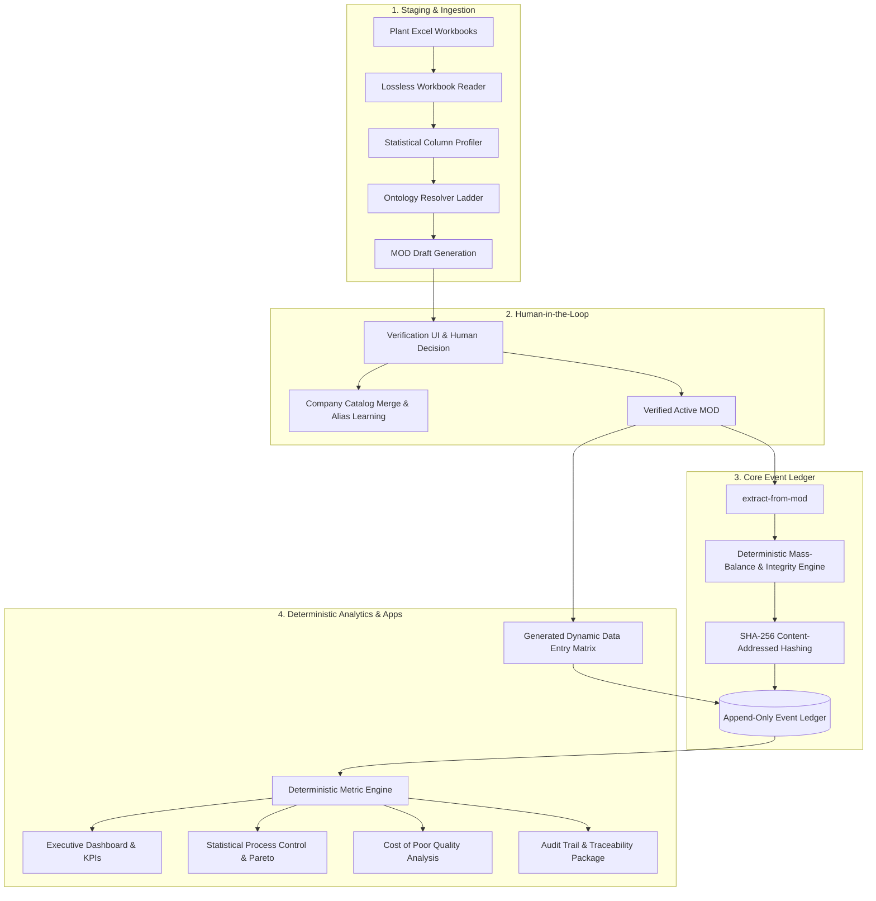
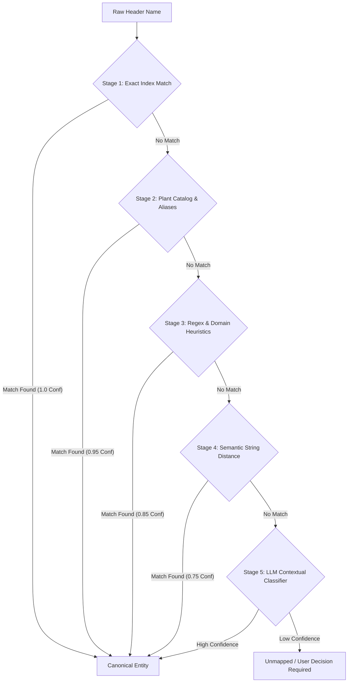
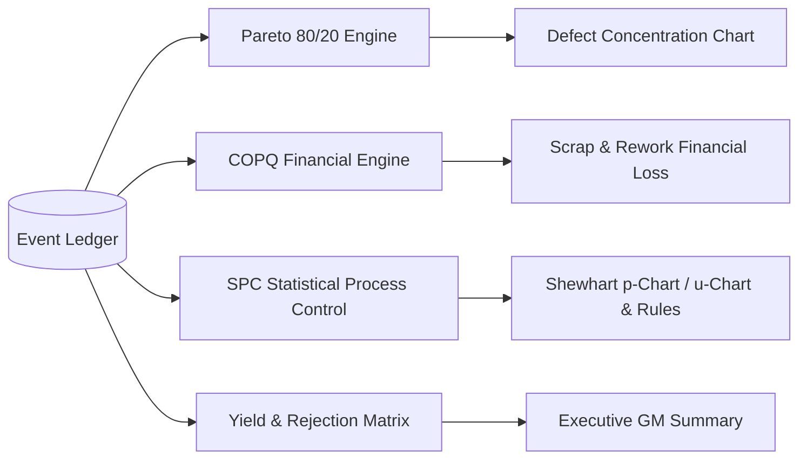
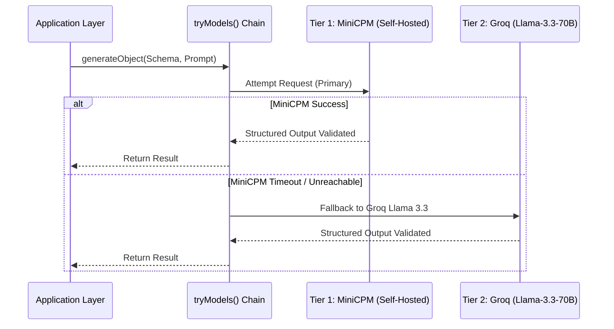

# MOID (RAIS-Pro) — Comprehensive Project Presentation
## Manufacturing Intelligence Operating System for Regulated Production

---

## Executive Summary & Slide Index

This document is structured as an interactive slide-deck & technical presentation for General Managers, Quality Managers, Lead Engineers, and System Architects.

- **Slide 1:** Project Overview & Problem Statement
- **Slide 2:** Core Philosophy & The "Hard Invariants"
- **Slide 3:** End-to-End Pipeline Architecture (The Real Flow)
- **Slide 4:** Workbook Ingestion & Lossless Profiling
- **Slide 5:** Ontology Resolver Ladder Algorithm (Exact → Rules → Semantic → LLM)
- **Slide 6:** Mapping Ontology Document (MOD) & Human-in-the-Loop Verification
- **Slide 7:** Append-Only Content-Addressed Event Ledger
- **Slide 8:** Mass Balance Verification & Deterministic Mathematical Recomputation
- **Slide 9:** Analytics Engine, Pareto, COPQ, and Statistical Process Control (SPC)
- **Slide 10:** Dynamic Data Entry Grid (Zero-Code Custom Schema Generation)
- **Slide 11:** Resilient Multi-Tier AI Architecture (MiniCPM + Groq Fallback)
- **Slide 12:** Regulated Compliance (ISO 13485, MDR 2017) & Complete Audit Trail
- **Slide 13:** Technology Stack & Deployment Topology

---



---

## Slide 1: Project Overview & The Plant Floor Problem

### The Context
Medical device manufacturers (such as Disposafe in Delhi, operating under **ISO 13485** and **EU MDR 2017**) generate thousands of daily shop-floor inspection records. 
Historically, production plants rely on massive, heterogeneous Excel sheets across different lines, shifts, and needle/cannula sizes (e.g., 18G, 20G, 22G, 24G, 26G).

### The Shop Floor Pain Points
1. **Broken Formulas & Unverified Calculations:** In Excel, operators accidentally delete formulas, sum rows inconsistently, or enter numbers where defects do not sum to total rejections.
2. **Brittle Schemas & Column Drift:** Each shift or line manager formats column names differently (e.g., `"BLUNT"`, `"BLUNT TIP"`, `"B.T."`, `"NEEDLE BLUNT"`).
3. **Black-Box AI Skepticism:** Regulators and quality directors cannot accept LLM hallucinations or non-deterministic calculations for regulatory metrics.
4. **Data Silos & Double-Entry:** Quality inspectors enter data on paper or Excel, which then has to be re-entered into enterprise ERPs with manual translation.

### The MOID Solution
MOID is a self-learning manufacturing intelligence operating system that:
- Ingests legacy Excel sheets losslessly.
- Maps plant-specific terminology to a canonical ontology using a tiered resolution ladder.
- Stores every observation in an immutable, content-addressed event ledger.
- Generates tailored daily data entry screens using the plant's own validated terminology.

---

## Slide 2: Core Philosophy & The "Hard Invariants"

The architecture of MOID is governed by four strict, non-negotiable architectural invariants:

### Invariant 1: "The Model Never Does Maths"
* **Rule:** Artificial Intelligence is strictly used for semantic classification (mapping unknown column names to canonical entities) and natural language synthesis (drafting CAPA recommendations, contextual chat).
* **Guarantees:** Every single KPI, yield percentage, defect rate, scrap cost, and SPC control limit is calculated by pure, deterministic TypeScript algorithms in `src/lib/analytics/`. Zero AI hallucinations in numerical reporting.

### Invariant 2: "The Ledger is Append-Only & Content-Addressed"
* **Rule:** No database record is ever updated in-place or deleted.
* **Mechanism:** Every event is hashed using SHA-256 over its canonical payload (`lib/contract/hash.ts`). Re-ingesting identical files produces identical hashes and deduplicates cleanly. Corrected data generates a new `CorrectionEvent` that supersedes the prior event in the sequence.

### Invariant 3: "The MOD is the Only Ingestion Path"
* **Rule:** No raw, unverified data bypasses the ontology layer.
* **Mechanism:** Data enters the ledger strictly through `extract-from-mod` (for workbook files) or generated direct entry views (`extractedBy: "direct-entry"`).

### Invariant 4: "Data Entry is Generated, Never Hardcoded"
* **Rule:** The UI adapts to the plant, not vice versa.
* **Mechanism:** `/api/entry-template` dynamically unions verified MODs and plant catalogs to produce live matrix and grid forms matching the plant's exact naming and column ordering.

---

## Slide 3: The End-to-End Pipeline

The operational lifecycle consists of 5 clear stages:

```
[ Plant Excel File ]
        │
        ▼ (POST /api/workbooks)
[ Core Workbook Reader + Profiler ]
        │
        ▼ (Ladder: Exact -> Aliases -> Heuristics -> LLM)
[ Draft MOD (Mapping Ontology Document) ]
        │
        ▼ (POST /api/mods/verify)
[ Human Verification & Promotion to Catalog ]
        │
        ▼ (POST /api/mods/records)
[ Extract Records + Deterministic Mass-Balance Review ]
        │
        ▼ (POST /api/ingest)
[ Commit to Append-Only Event Ledger (SHA-256) ]
        │
        ▼
[ Real-Time Analytics / Dashboards / SPC / COPQ / Audit Trail ]
```

---

## Slide 4: Workbook Ingestion & Profiling

### Lossless Workbook Snapshotting
When an operator uploads an `.xlsx` or `.xls` file:
1. `src/core/workbook/reader.ts` parses the workbook into an AST using SheetJS (`xlsx`).
2. Header rows are automatically detected using statistical row profiling (`header-detection.ts`), locating the exact row where column labels begin even if the file starts with merged decorative titles or blank rows.
3. The raw file snapshot is stored losslessly with its original cell references (e.g., `Sheet1!C4:N28`).

### Column Statistical Profiler (`src/core/profiler/index.ts`)
Each column is profiled across several dimensions:
- **Data Type Distribution:** Percentage of values that are numbers, dates, strings, or blanks.
- **Value Cardinality & Distinctness:** Identifies identifiers vs. categorical groupings.
- **Statistical Moments:** Mean, min, max, variance for numerical columns.
- **Sample Representation:** Extracts representative samples for entity resolution.

---

## Slide 5: The Ontology Resolver Ladder Algorithm

To map diverse column headers into canonical roles (`production_date`, `batch_id`, `quantity_checked`, `quantity_rejected`, `defect:<id>`, `size:<id>`, `stage:<id>`), MOID implements an **Algorithmic Fallback Ladder**:



### Ladder Details:
1. **Tier 1 - Exact Index:** Normalized direct lookup against canonical ontology keys.
2. **Tier 2 - Plant Catalog & Learned Aliases:** Historical mappings previously confirmed by plant managers are queried instantly.
3. **Tier 3 - Deterministic Heuristics & RegEx:** Domain-specific pattern matching (e.g., `/\b(qty|inspected|checked|total\s*prod)\b/i` → `quantity_checked`).
4. **Tier 4 - Semantic String Distance:** Levenshtein / Jaro-Winkler distance against known defect catalogs.
5. **Tier 5 - Multi-Model AI Resolver:** When structural ambiguity exists, the column name along with surrounding header samples is sent to MiniCPM/Groq with strict Zod structured outputs.

---

## Slide 6: Mapping Ontology Document (MOD) & Human-in-the-Loop

### What is a MOD?
A **MOD (Mapping Ontology Document)** is a declarative JSON specification describing the semantic structure of a plant's document.

```json
{
  "modId": "mod_disposafe_cannula_assy_v1",
  "workbookId": "wb_2026_08_assembly_01",
  "version": 1,
  "status": "verified",
  "mappings": [
    { "sourceColumn": "LOT NO", "targetRole": "batch_id", "confidence": 1.0 },
    { "sourceColumn": "TOTAL INSP", "targetRole": "quantity_checked", "confidence": 0.98 },
    { "sourceColumn": "B.T.", "targetRole": "defect:blunt_tip", "confidence": 0.92 },
    { "sourceColumn": "BENT", "targetRole": "defect:bent_needle", "confidence": 0.95 }
  ]
}
```

### Verification & Catalog Promotion
- The **Mapping Verification Panel** highlights high-confidence vs. ambiguous mappings to the Quality Manager.
- Once verified, publishing the MOD does three actions simultaneously:
  1. **Promotes** newly discovered defect/size entities into the permanent **Company Catalog**.
  2. **Learns** the source column strings as persistent aliases for automated zero-shot recognition next time.
  3. **Unlocks** record extraction for the ledger.

---

## Slide 7: Append-Only Content-Addressed Event Ledger

### The Data Contract (`src/lib/contract/d1.ts`)
All operational data is represented as typed canonical events:
- `ProductionBatchEvent`: Batch initiation, operator, machine, line metadata.
- `InspectionRecordEvent`: Checked units, rejected units, defect breakdowns per size/stage.
- `DefectObservationEvent`: Granular defect counts linked to root causes.
- `CorrectionEvent`: Audit-backed adjustments pointing to the original event hash.

### Cryptographic Content Hashing (`src/lib/contract/hash.ts`)
```typescript
hash = SHA256(canonicalize({
  streamId,
  eventType,
  timestamp,
  payload,
  metadata: { sourceFile, sheetName, cellRange }
}))
```
- Ensures complete idempotence: duplicate file uploads cannot corrupt or double-count production metrics.
- Provides tamper-evident compliance for medical audit trails.

---

## Slide 8: Mass Balance & Deterministic Integrity Checks

In regulated manufacturing, mass balance is king: **Units Checked = Units Accepted + Units Rejected (Sum of all defects)**.

Excel spreadsheets often contain silent math errors:
- Operator types `Total Rejected = 50`, but listed defect rows sum to `42`.
- Formulas fail to account for inserted columns.

### MOID Integrity Engine (`src/lib/ingest/mass-balance.ts` & `review.ts`):
1. **Never trusts spreadsheet formulas.** Every sum is recomputed directly from the atomic cell values.
2. **Calculates Mass Balance Delta:** $\Delta = Q_{\text{checked}} - (Q_{\text{accepted}} + \sum D_i)$
3. **Discrepancy Highlighting:** Flags unbalancing rows with exact cell provenance prior to ledger commitment, allowing operators to resolve mismatches before data enters the audit stream.

---

## Slide 9: Analytics, SPC, COPQ & Pareto Engines

All dashboards and reports run pure deterministic calculations over the event ledger:



### Statistical Process Control (SPC)
- Calculates Upper Control Limits ($\text{UCL}$) and Lower Control Limits ($\text{LCL}$):
  $$\text{CL} = \bar{p}, \quad \text{UCL} = \bar{p} + 3\sqrt{\frac{\bar{p}(1-\bar{p})}{\bar{n}}}, \quad \text{LCL} = \max\left(0, \bar{p} - 3\sqrt{\frac{\bar{p}(1-\bar{p})}{\bar{n}}}\right)$$
- Evaluates Western Electric and Nelson Rules for out-of-control signals:
  - Rule 1: One point beyond Zone A ($> 3\sigma$).
  - Rule 2: 9 consecutive points on one side of the centerline.
  - Rule 3: 6 consecutive points steadily increasing or decreasing.

### Cost of Poor Quality (COPQ)
- Connects physical rejections with raw material unit costs, labor cost per stage, and scrap disposal overhead to show direct P&L financial leakage.

---

## Slide 10: Dynamic Data Entry Matrix

Instead of forcing operators to conform to an external schema:
1. `/api/entry-template` unions verified MODs and catalog modifications.
2. The UI renders dynamic tabular grids (`BatchMatrixEntry.tsx`, `MonthlyEntryGrid.tsx`) using the plant's authentic column names and visual order.
3. Operators enter shop-floor records with automated keyboard navigation, auto-balancing calculations, and instant validation before committing directly to the ledger.

---

## Slide 11: Resilient Multi-Tier AI Provider Chain

All AI interactions run through the unified orchestration pipeline in `src/lib/ai.ts`:



- **OpenAI-Compatible Standard:** Addresses both backends through `@ai-sdk/openai-compatible`.
- **Zero-SDK Sprawl:** No proprietary, vendor-locked libraries.
- **Strict Schema Adherence:** Enforced through Zod runtime type guards.

---

## Slide 12: Regulated Medical Compliance (ISO 13485 & MDR)

| Requirement | Regulatory Standard | MOID Implementation |
|---|---|---|
| **Data Integrity (ALCOA+)** | 21 CFR Part 11 / Annex 11 | Append-only ledger, SHA-256 content hashes, uneditable audit logs. |
| **Formula Traceability** | ISO 13485:2016 Cl. 4.2.5 | Recomputed math; every figure traces back to source file, sheet, and cell. |
| **Corrective Actions (CAPA)** | ISO 13485:2016 Cl. 8.5.2 | AI-assisted CAPA drafting referencing specific out-of-control batches. |
| **Audit Package Export** | MDR 2017 / FDA Inspection | Instant one-click cryptographic audit package compilation (`audit-package.ts`). |

---

## Slide 13: Technology Stack & Deployment Topology

### Front-End & Application
- **Next.js 16 (App Router) + React 19 + TypeScript 5**
- **Token-Based Theming:** CSS variables live-controlled via `TweaksContext` (Geist & Geist Mono typography, zero external font imports).
- **Inline SVG Visualization:** Ultra-performant, zero-dependency charts (`components/app/widgets.tsx`, `editorial/EditorialCharts.tsx`).

### Backend & Persistence
- **Storage Layer:** Dual-mode storage adapter (Supabase PostgreSQL with Row Level Security, or zero-config in-memory store for isolated local deployments).
- **On-Premise Ready:** Single-node Docker Compose appliance with backup, restore, and air-gapped support (`deploy/` kit).

---

## Summary & Key Takeaways

1. **MOID bridges legacy Excel and modern intelligence** without forcing plants to overhaul their shop-floor habits.
2. **AI classifies and writes prose; deterministic math computes all numbers.**
3. **The ledger is immutable, cryptographically verifiable, and audit-ready for medical regulatory standards.**
4. **Data entry and analytics dynamically reflect the living, verified plant catalog.**
